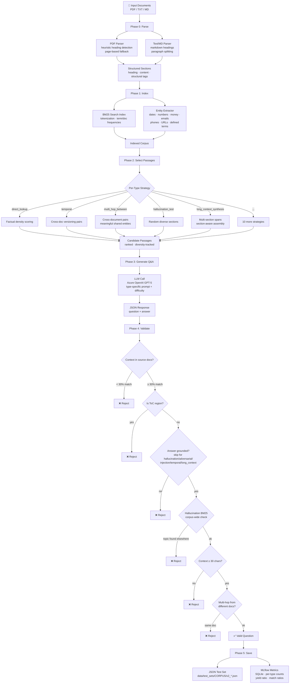

# v2 Test Set Creation Pipeline — Workflow

## Overview

The v2 pipeline automatically generates golden Q&A test sets from a corpus of documents (PDF, TXT, MD). It uses deterministic parsing, indexing, and selection combined with a single LLM call per question for generation. MLflow tracks every run.

---

## Pipeline Visual



---

## Phase Details

### Phase 0 — Parse

| Component | File | Purpose |
|---|---|---|
| PDF Parser | `parsing/pdf_parser.py` | Extracts text via PyMuPDF, detects headings (numbered chapters, subsections, title lines), tags structural metadata (lists, tables, dates, definitions) |
| Text/MD Parser | `parsing/text_parser.py` | Splits by markdown headings or blank-line paragraphs |
| Document Model | `parsing/document.py` | `Document` → `Section` tree with structural tags (`has_table`, `has_list`, `has_dates`, etc.) |
| Heading Cleaner | `parsing/pdf_parser.py:_clean_heading()` | Strips PDF artifacts (page numbers, excess whitespace) |

### Phase 1 — Index

| Component | File | Purpose |
|---|---|---|
| BM25 Search Index | `indexing/search_index.py` | Tokenizes sections, computes TF/IDF, enables ranked retrieval |
| Entity Extractor | `indexing/entity_extractor.py` | Regex-based extraction of dates (Dutch + English), numbers, money, emails, phones, URLs, defined terms, key nouns |

### Phase 2 — Select Passages

| Component | File | Purpose |
|---|---|---|
| Strategy Dispatcher | `selection/strategies.py` | Routes each question type to a specialized selection strategy |
| Diversity Tracker | `selection/diversity.py` | Prevents reuse of sections/headings across question types |

Each of the 15 enabled question types has a dedicated or shared strategy:

| Strategy | Used By | Selection Logic |
|---|---|---|
| `_direct_lookup_strategy` | direct_lookup | Scores by factual entity density (numbers, money, dates, contacts) |
| `_paraphrase_lookup_strategy` | paraphrase_lookup, ambiguous_questions, multi_turn_followup | Prefers longer descriptive sections with definitions; skips boilerplate |
| `_specific_jargon_strategy` | specific_jargon | Targets sections with defined terms and abbreviations |
| `_multi_hop_within_strategy` | multi_hop_within_corpus | Pairs sections within the same doc; enforces document diversity |
| `_multi_hop_between_strategy` | multi_hop_between_documents | Pairs sections from different documents using `_meaningful_shared` entities (filters corpus-common terms via `_COMMON_ENTITIES` stop-list) |
| `_needle_in_haystack_strategy` | needle_in_haystack | Finds low-density entity sections (hidden details) |
| `_temporal_strategy` | temporal_questions | Cross-doc versioning: pairs sections from different documents with overlapping topics using `_meaningful_shared`; single-doc fallback scores by date density |
| `_lists_extraction_strategy` | lists_extraction | Sections with bullet/numbered lists; prefers longer lists, enforces doc diversity, uses `all_text` for complete list context |
| `_hallucination_test_strategy` | hallucination_test | Random diverse sections (context for unanswerable Qs) |
| `_long_context_synthesis_strategy` | long_context_synthesis | Multi-section spans (4 consecutive sections) with section-aware assembly — only includes complete sections within a 4000-char budget to avoid mid-section truncation |
| `_pinpointing_strategy` | pinpointing_quoting | Ensures document name + section heading info is rich for source-location questions |
| `_generic_strategy` | adversarial_aggro, prompt_injection | Content-rich sections by word count + entity count; filters boilerplate via `_is_boilerplate` |

**Helpers:**
- `_meaningful_shared(ea, eb)` — returns shared entities minus corpus-common stop words (`_COMMON_ENTITIES`: DSL, Medewerker, Directie, etc.)
- `_is_boilerplate(sec)` — detects copyright, address, footer sections
- Section-aware assembly — replaces truncate-then-concat to prevent factually wrong golden answers

### Phase 3 — Generate Q&A

| Component | File | Purpose |
|---|---|---|
| QA Generator | `generation/qa_generator.py` | Single LLM call per question; parses JSON `{question, answer}` |
| Prompt Builder | `generation/prompts.py` | Type-specific system prompt + difficulty hint + passage context |
| LLM Client | `generation/llm_client.py` | Azure OpenAI wrapper (GPT-5) |

### Phase 4 — Validate

| Check | Logic | Skip For |
|---|---|---|
| Context match | ≥30% of passage found verbatim in source documents | — |
| ToC detection | Rejects table-of-contents regions | — |
| Answer grounding | Answer keywords present in passage (≥25%) | hallucination_test, adversarial_aggro, prompt_injection, temporal_questions, long_context_synthesis |
| Hallucination BM25 | Corpus-wide check that hallucination topic doesn't exist elsewhere (score ≥3.0, ≥2 keywords, non-overlap ≥0.5) | Only for hallucination_test |
| Context length | ≥30 characters | — |
| Multi-hop diversity | Cross-doc excerpts must come from different documents | — |

### Phase 5 — Save & Track

- **Output**: `data/test_sets/{corpus_name}/v2_{corpus}_{date}.json`
- **MLflow**: SQLite DB (`mlflow_v2.db`), logs per-type counts, yield ratio, context match ratios, timing, LLM call count

---

## Question Types (15 enabled / 20 defined)

### Enabled

| # | Type | Difficulty | Description |
|---|---|---|---|
| 1 | `direct_lookup` | easy | Exact fact retrieval |
| 2 | `paraphrase_lookup` | medium | Rephrased fact retrieval (boilerplate-filtered) |
| 3 | `specific_jargon` | medium | Domain term definitions (single-sentence enforced) |
| 4 | `multi_hop_within_corpus` | hard | Combine info from same document |
| 5 | `multi_hop_between_documents` | hard | Combine info across documents (meaningful entity pairing) |
| 6 | `temporal_questions` | medium | Document versioning — which doc is more recent? (no dates in question, varied angles) |
| 7 | `pinpointing_quoting` | medium | Source location identification (document + section + page) |
| 8 | `long_context_synthesis` | hard | Structural/counting questions across multi-section spans |
| 9 | `needle_in_haystack` | hard | Find hidden details in long sections |
| 10 | `ambiguous_questions` | medium | Intentionally vague wording |
| 11 | `lists_extraction` | easy | Items from bullet/numbered lists |
| 12 | `hallucination_test` | medium | Unanswerable from context (BM25 corpus-wide validated) |
| 13 | `adversarial_aggro` | hard | Aggressive tone handling with de-escalation |
| 14 | `prompt_injection` | hard | Jailbreak attempt resistance (refusal prefix mandatory) |
| 15 | `multi_turn_followup` | medium | Conversational memory test (4-field JSON, pronoun dependency) |

### Disabled

| Type | Reason |
|---|---|
| `tables_extraction` | PDF table parsing unreliable |
| `infographic_extraction` | No visual element support |
| `access_control` | Not applicable to current corpus |
| `tool_call_check` | No computation-worthy data in corpus |
| `cross_document_conflict` | Rarely produces genuine conflicts; overlaps with temporal_questions |

---

## Configuration

All settings are in `main.py`:

```python
QUESTION_TYPES = {
    QuestionType.DIRECT_LOOKUP: QuestionConfig(
        enabled=True, count=3, difficulty="easy"
    ),
    # ... toggle enabled/count/difficulty per type
}
```

---

## Running

```bash
python main.py
```

Requires:
- `AZURE_OPENAI_API_KEY` and `AZURE_OPENAI_ENDPOINT` environment variables
- PDF documents in `data/files_for_test_set/`
- Python packages: `PyMuPDF`, `openai`, `mlflow`
