# v2 Test Set Creation Pipeline — Workflow

## Overview

The v2 pipeline automatically generates golden Q&A test sets from a corpus of documents (PDF, TXT, MD). It uses deterministic parsing, indexing, and selection combined with a single LLM call per question for generation. MLflow tracks every run.

---

## Pipeline Visual

```mermaid
flowchart TD
    A[📄 Input Documents\nPDF / TXT / MD] --> B[Phase 0: Parse]
    B --> B1[PDF Parser\nheuristic heading detection\npage-based fallback]
    B --> B2[Text/MD Parser\nmarkdown headings\nparagraph splitting]
    B1 --> C[Structured Sections\nheading · content · structural tags]
    B2 --> C

    C --> D[Phase 1: Index]
    D --> D1[BM25 Search Index\ntokenization · term/doc frequencies]
    D --> D2[Entity Extractor\ndates · numbers · money · emails\nphones · URLs · defined terms]
    D1 --> E[Indexed Corpus]
    D2 --> E

    E --> F[Phase 2: Select Passages]
    F --> F1{Per-Type Strategy}
    F1 -->|direct_lookup| F2[Factual density scoring]
    F1 -->|temporal| F3[Date/duration density]
    F1 -->|multi_hop_between| F4[Cross-document pairs]
    F1 -->|hallucination_test| F5[Random diverse sections]
    F1 -->|tables_extraction| F6[Table/number-dense sections]
    F1 -->|...| F7[12 more strategies]
    F2 & F3 & F4 & F5 & F6 & F7 --> G[Candidate Passages\nranked · diversity-tracked]

    G --> H[Phase 3: Generate Q&A]
    H --> H1[LLM Call\nAzure OpenAI GPT-5\ntype-specific prompt + difficulty]
    H1 --> H2[JSON Response\nquestion + answer]

    H2 --> I[Phase 4: Validate]
    I --> I1{Context in source docs?}
    I1 -->|< 30% match| X1[❌ Reject]
    I1 -->|≥ 30% match| I2{Is ToC region?}
    I2 -->|yes| X2[❌ Reject]
    I2 -->|no| I3{Answer grounded?\nskip for hallucination/adversarial/\ninjection/tool_call}
    I3 -->|no| X3[❌ Reject]
    I3 -->|yes| I4{Context ≥ 30 chars?}
    I4 -->|no| X4[❌ Reject]
    I4 -->|yes| I5{Multi-hop from\ndifferent docs?}
    I5 -->|same doc| X5[❌ Reject]
    I5 -->|ok| V[✅ Valid Question]

    V --> J[Phase 5: Save]
    J --> J1[JSON Test Set\ndata/test_sets/CORPUS/v2_*.json]
    J --> J2[MLflow Metrics\nSQLite · per-type counts\nyield ratio · match ratios]
```



---

## Phase Details

### Phase 0 — Parse

| Component | File | Purpose |
|---|---|---|
| PDF Parser | `parsing/pdf_parser.py` | Extracts text via PyMuPDF, detects headings (numbered chapters, subsections, title lines), tags structural metadata (lists, tables, dates, definitions) |
| Text/MD Parser | `parsing/text_parser.py` | Splits by markdown headings or blank-line paragraphs |
| Document Model | `parsing/document.py` | `Document` → `Section` tree with structural tags (`has_table`, `has_list`, `has_dates`, etc.) |
| Heading Cleaner | `parsing/pdf_parser.py:_clean_heading()` | Strips PDF artifacts (page numbers, excess whitespace) |

### Phase 1 — Index

| Component | File | Purpose |
|---|---|---|
| BM25 Search Index | `indexing/search_index.py` | Tokenizes sections, computes TF/IDF, enables ranked retrieval |
| Entity Extractor | `indexing/entity_extractor.py` | Regex-based extraction of dates (Dutch + English), numbers, money, emails, phones, URLs, defined terms, key nouns |

### Phase 2 — Select Passages

| Component | File | Purpose |
|---|---|---|
| Strategy Dispatcher | `selection/strategies.py` | Routes each question type to a specialized selection strategy |
| Diversity Tracker | `selection/diversity.py` | Prevents reuse of sections/headings across question types |

Each of the 20 question types has a dedicated or shared strategy:

| Strategy | Used By | Selection Logic |
|---|---|---|
| `_direct_lookup_strategy` | direct_lookup, pinpointing_quoting, tool_call_check | Scores by factual entity density (numbers, money, dates, contacts) |
| `_paraphrase_lookup_strategy` | paraphrase_lookup, long_context_synthesis, ambiguous_questions, multi_turn_followup | Prefers longer descriptive sections with definitions |
| `_specific_jargon_strategy` | specific_jargon | Targets sections with defined terms and abbreviations |
| `_multi_hop_within_strategy` | multi_hop_within_corpus | Pairs sections within the same doc; enforces document diversity |
| `_multi_hop_between_strategy` | multi_hop_between_documents, cross_document_conflict | Pairs sections from different documents using shared entities |
| `_needle_in_haystack_strategy` | needle_in_haystack | Finds low-density entity sections (hidden details) |
| `_temporal_strategy` | temporal_questions | Scores by date/duration count |
| `_lists_extraction_strategy` | lists_extraction | Sections with bullet/numbered lists |
| `_tables_extraction_strategy` | tables_extraction | Sections with `has_table`; falls back to number-dense sections |
| `_hallucination_test_strategy` | hallucination_test | Random diverse sections (context for unanswerable Qs) |
| `_generic_strategy` | adversarial_aggro, prompt_injection, access_control, infographic_extraction | Content-rich sections by word count + entity count |

### Phase 3 — Generate Q&A

| Component | File | Purpose |
|---|---|---|
| QA Generator | `generation/qa_generator.py` | Single LLM call per question; parses JSON `{question, answer}` |
| Prompt Builder | `generation/prompts.py` | Type-specific system prompt + difficulty hint + passage context |
| LLM Client | `generation/llm_client.py` | Azure OpenAI wrapper (GPT-5) |

### Phase 4 — Validate

| Check | Logic | Skip For |
|---|---|---|
| Context match | ≥30% of passage found verbatim in source documents | — |
| ToC detection | Rejects table-of-contents regions | — |
| Answer grounding | Answer keywords present in passage (≥25%) | hallucination_test, adversarial_aggro, prompt_injection, tool_call_check |
| Context length | ≥30 characters | — |
| Multi-hop diversity | Cross-doc excerpts must come from different documents | — |

### Phase 5 — Save & Track

- **Output**: `data/test_sets/{corpus_name}/v2_{corpus}_{date}.json`
- **MLflow**: SQLite DB (`mlflow_v2.db`), logs per-type counts, yield ratio, context match ratios, timing, LLM call count

---

## Question Types (20)

| # | Type | Difficulty | Description |
|---|---|---|---|
| 1 | `direct_lookup` | easy | Exact fact retrieval |
| 2 | `paraphrase_lookup` | medium | Rephrased fact retrieval |
| 3 | `specific_jargon` | medium | Domain term definitions |
| 4 | `multi_hop_within_corpus` | hard | Combine info from same document |
| 5 | `multi_hop_between_documents` | hard | Combine info across documents |
| 6 | `cross_document_conflict` | hard | Find contradictions between docs |
| 7 | `temporal_questions` | medium | Date/deadline/duration questions |
| 8 | `pinpointing_quoting` | medium | Exact quote or location |
| 9 | `long_context_synthesis` | hard | Summarize spread-out information |
| 10 | `needle_in_haystack` | hard | Find hidden details |
| 11 | `ambiguous_questions` | medium | Intentionally vague wording |
| 12 | `tool_call_check` | hard | Calculation/computation from data |
| 13 | `tables_extraction` | medium | Data from tabular content |
| 14 | `lists_extraction` | easy | Items from bullet/numbered lists |
| 15 | `infographic_extraction` | medium | Visual element interpretation |
| 16 | `hallucination_test` | medium | Unanswerable from context |
| 17 | `adversarial_aggro` | hard | Aggressive tone handling |
| 18 | `prompt_injection` | hard | Jailbreak attempt resistance |
| 19 | `multi_turn_followup` | medium | Conversational memory test |
| 20 | `access_control` | hard | Permission-based access |

---

## Configuration

All settings are in `main.py`:

```python
QUESTION_TYPES = {
    QuestionType.DIRECT_LOOKUP: QuestionConfig(
        enabled=True, count=3, difficulty="easy"
    ),
    # ... toggle enabled/count/difficulty per type
}
```

---

## Running

```bash
python v2_test_set_creation/main.py
```

Requires:
- `AZURE_OPENAI_API_KEY` and `AZURE_OPENAI_ENDPOINT` environment variables
- PDF documents in `data/files_for_test_set/`
- Python packages: `PyMuPDF`, `openai`, `mlflow`
